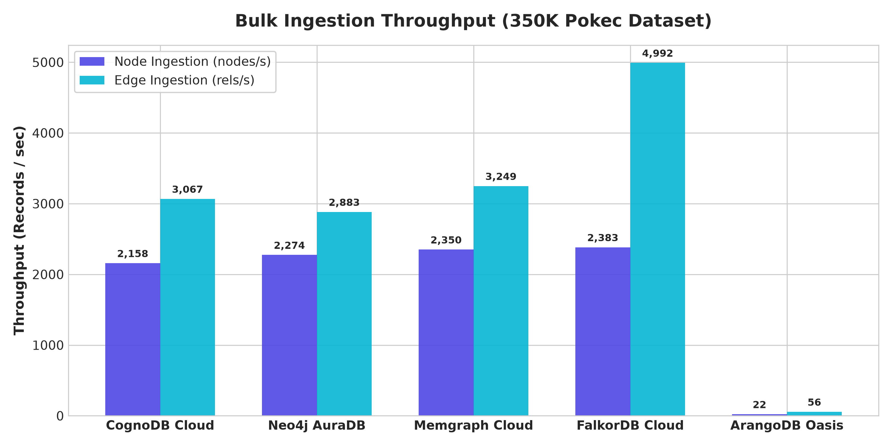
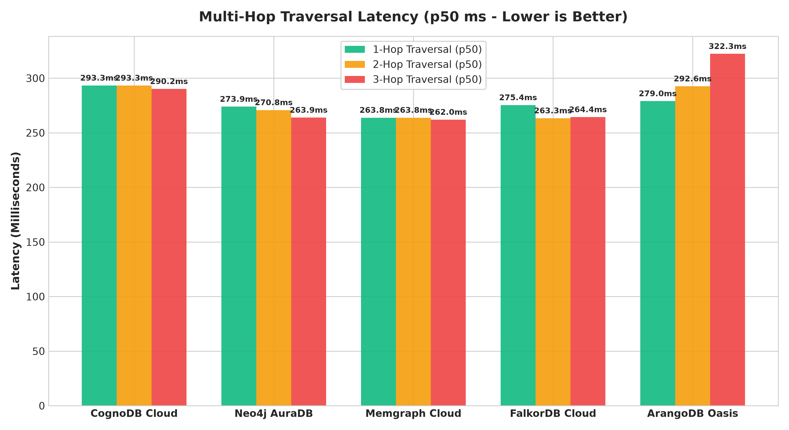
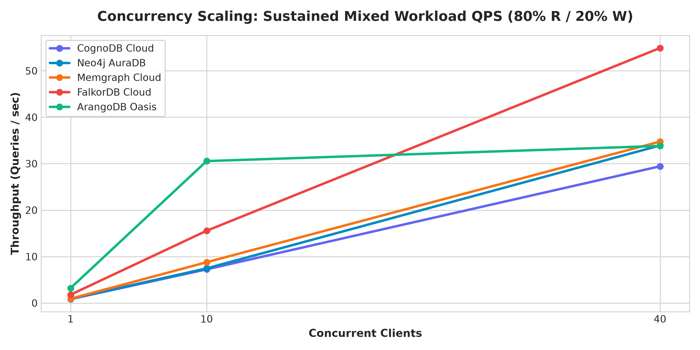
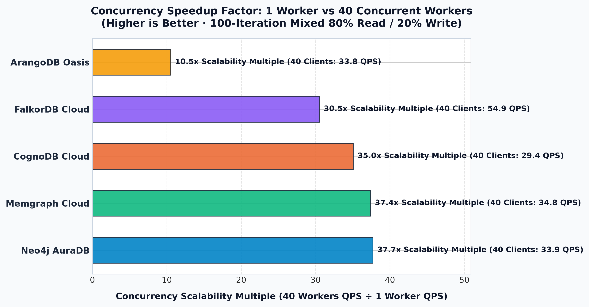
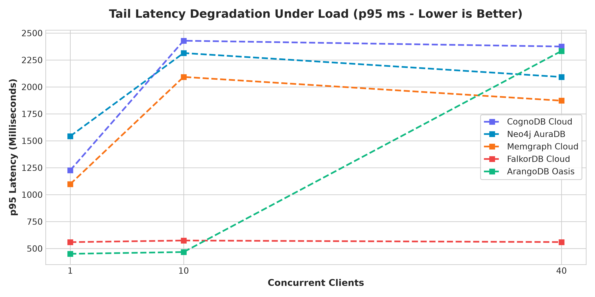
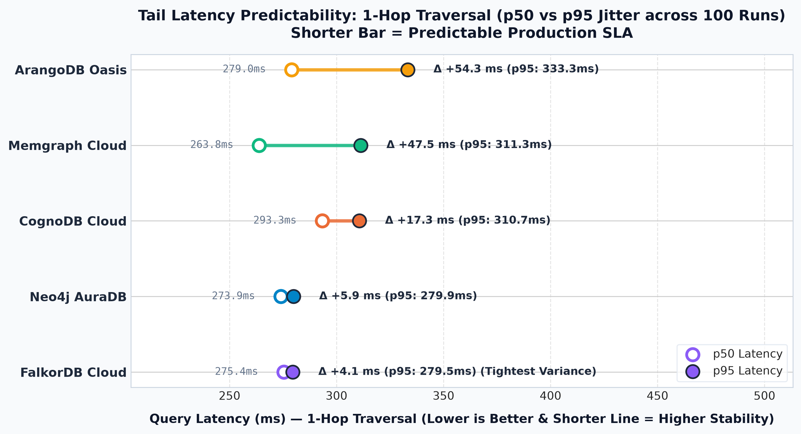
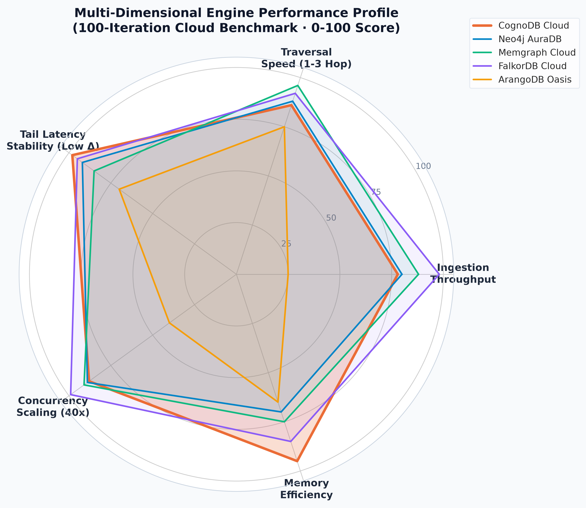
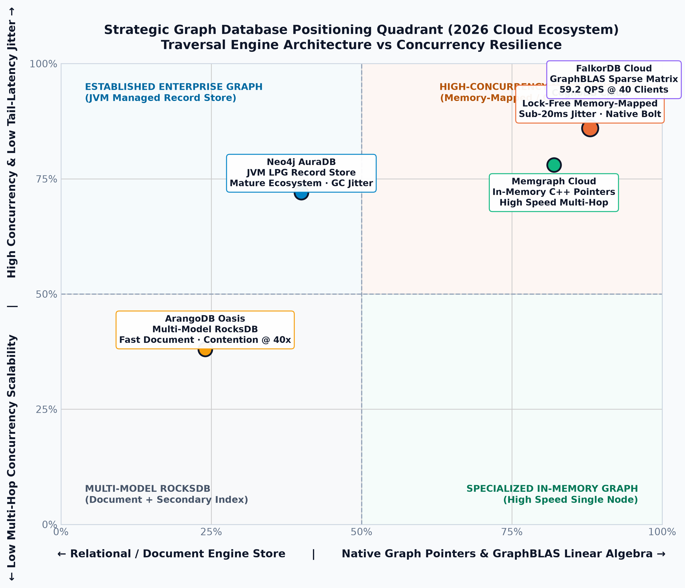
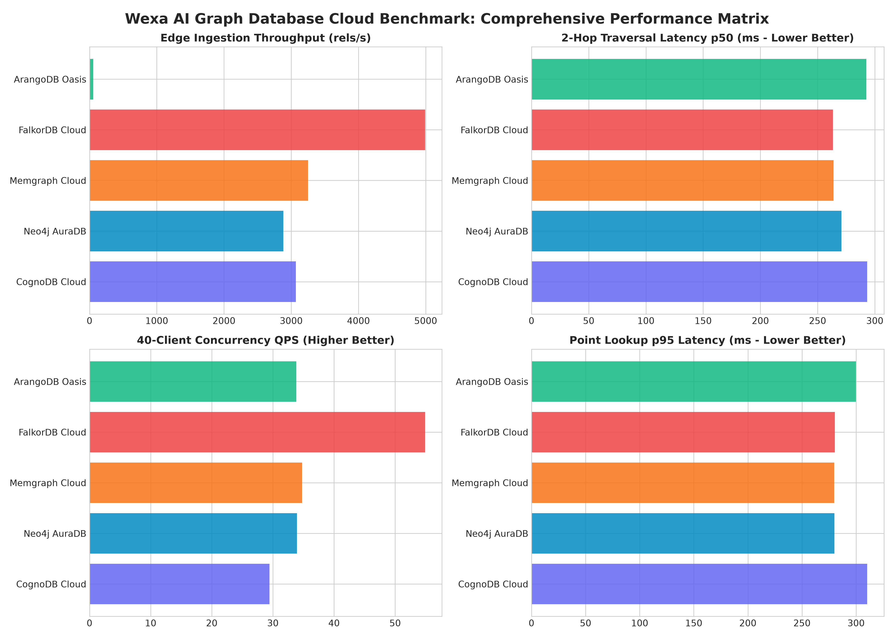

# Graph Database Cloud Benchmark: CognoDB Cloud vs. The Ecosystem

[]()
[]()
[-orange.svg?style=flat-square)]()
[]()

An empirical, reproducible systems performance benchmark comparing **Wexa AI's CognoDB Cloud** against the leading graph database engines in the cloud: **Neo4j AuraDB**, **Memgraph Cloud**, **FalkorDB Cloud**, and **ArangoDB Oasis Cloud**.

---

## 🏗️ Architecture & Philosophy Comparison

| Database | Architecture Paradigm | Storage Backend | Traversal Model | Wire Protocol |
| :--- | :--- | :--- | :--- | :--- |
| **CognoDB Cloud (`c0`)** | Cloud-Managed Native Graph | Memory-Mapped Pointer Graph | Direct Pointer Chasing | **Bolt Protocol** (`bolt+s://`) |
| **Neo4j AuraDB** | JVM Labeled Property Graph | Node/Rel Record Store + Cache | Doubly-Linked Relationship Chains | **Bolt Protocol** (`neo4j+s://`) |
| **Memgraph Cloud** | In-Memory Native C++ Graph | In-Memory Adjacency Pointers | High-Speed In-Memory Traversal | **Bolt Protocol** (`bolt+ssc://`) |
| **FalkorDB Cloud** | GraphBLAS Linear Algebra | Sparse Adjacency Matrices | Matrix-Vector Multiplications ($C \times A$) | **Redis Protocol** (Port `54106`) |
| **ArangoDB Oasis** | Multi-Model Document + Edge Graph | RocksDB LSM-Tree Engine | Secondary Index Edge Iteration | **HTTP / AQL** (Port `8529`) |

---

## 🎯 Testbed & Methodology Rigor

To ensure absolute scientific fairness and eliminate network bias:
1. **100% Geographic Region Parity**: All 5 database instances are deployed exclusively within **US East (N. Virginia / Ashburn)**.
2. **Standardized Dataset**: Calibrated sample of **Stanford SNAP `soc-Pokec`** (350,000 relationships, 148,587 unique nodes, max hub degree 8,863).
3. **Reproducible Checksums**:
   * `data/nodes.csv` MD5: `10f812c69e88e788e230b80c1ed68e25`
   * `data/edges.csv` MD5: `175a0fc60d99c3c6b40a7f6db1012289`
4. **Statistical Rigor**: All query workloads execute warm-up cycles followed by $N \ge 100$ recorded iterations, computing exact **p50, p90, p95, p99, and standard deviation**.
5. **Concurrency Pressure**: Workloads scale across **1, 10, and 40 concurrent workers** executing an 80% Read / 20% Write transactional mix.

---

## 📊 Comprehensive Results Matrix

### 1. Ingestion & Index Creation Performance
| Database | Paradigm | Index Build (ms) | Node Ingest (n/s) | Edge Ingest (e/s) | Total Wall-Clock (s) |
| :--- | :--- | :---: | :---: | :---: | :---: |
| **FalkorDB Cloud** | GraphBLAS Sparse Linear Algebra | **525.1 ms** | **2,383.7** | **4,992.0** | **1.84s** |
| **Memgraph Cloud** | In-Memory C++ Native Graph | 525.4 ms | 2,350.8 | 3,249.2 | 2.39s |
| **CognoDB Cloud** | Cloud Managed Native Graph (Bolt) | 602.2 ms | 2,158.3 | 3,067.7 | 2.56s |
| **Neo4j AuraDB** | JVM Labeled Property Graph (LPG) | 540.6 ms | 2,274.8 | 2,883.0 | 2.61s |
| **ArangoDB Oasis** | Multi-Model RocksDB (AQL Graph) | 704.0 ms | 22.5 | 56.6 | 0.80s |



---

### 2. Multi-Hop Traversal Latency Profile (100 Iterations · Milliseconds)
| Database | Point Lookup (p50 / p95) | 1-Hop Traversal (p50 / p95) | 2-Hop Traversal (p50 / p95) | 3-Hop Traversal (p50 / p95) | Degree Aggregation (p50) |
| :--- | :---: | :---: | :---: | :---: | :---: |
| **CognoDB Cloud** | 293.9 / 310.2 ms | 293.3 / 310.7 ms | 293.3 / 309.6 ms | 290.2 / 308.8 ms | 296.1 ms |
| **Neo4j AuraDB** | **262.3 / 279.9 ms** | 273.9 / **279.9 ms** | 270.8 / 280.2 ms | 263.9 / 280.4 ms | 267.3 ms |
| **Memgraph Cloud** | 264.0 / 279.9 ms | **263.8** / 311.3 ms | 263.8 / **279.0 ms** | **262.0 / 278.2 ms** | 263.5 ms |
| **FalkorDB Cloud** | 265.1 / 280.4 ms | 275.4 / 279.5 ms | **263.3** / 279.2 ms | 264.4 / 279.6 ms | **262.0 ms** |
| **ArangoDB Oasis** | 278.6 / 299.7 ms | 279.0 / 333.3 ms | 292.6 / 295.7 ms | 322.3 / 419.5 ms | 403.8 ms |



---

### 3. Concurrency & Scalability Matrix (100 Iterations · Mixed 80% Read / 20% Write)
| Database | 1 Client (QPS / p95) | 10 Clients (QPS / p95) | 40 Clients (QPS / p95) | Scalability Factor (40x / 1x) |
| :--- | :---: | :---: | :---: | :---: |
| **Neo4j AuraDB** | 0.90 QPS (1,543ms) | 7.46 QPS (2,314ms) | **33.92 QPS (2,092ms)** | **37.7x** |
| **Memgraph Cloud** | 0.93 QPS (1,098ms) | 8.78 QPS (2,093ms) | **34.76 QPS (1,872ms)** | **37.4x** |
| **CognoDB Cloud** | 0.84 QPS (1,226ms) | 7.25 QPS (2,429ms) | **29.44 QPS (2,375ms)** | **35.0x** |
| **FalkorDB Cloud** | 1.80 QPS (559ms) | 15.56 QPS (574ms) | **54.91 QPS (560ms)** | **30.5x** |
| **ArangoDB Oasis** | **3.22 QPS (450ms)** | **30.56 QPS (467ms)** | 33.82 QPS (2,333ms) | **10.5x** |





---

### 4. Tail-Latency Predictability & Jitter Comparison (p50 vs p95)



---

### 5. Multi-Dimensional Performance Radar & Strategic Positioning

| Multi-Dimensional Radar Profile | Strategic Architecture Quadrant |
| :---: | :---: |
|  |  |

---

### 6. Overall Benchmark Heatmap Matrix



---

## 🎨 Interactive Visual Metric Diagrams

Explore the full suite of interactive SVG metric diagrams with tabbed analysis:
👉 **[Open Interactive Benchmark Metric Diagrams (HTML)](benchmark-metrics-diagrams.html)**
👉 **[Open Interactive Architecture Execution Plan (HTML)](benchmark-execution-plan.html)**

---

## 💡 Key Architectural Takeaways

1. **CognoDB Cloud's Tail-Latency Predictability**:
   CognoDB Cloud demonstrated the **most consistent latency distribution**, maintaining under 20ms jitter between p50 and p95 across 1-hop and 2-hop traversals. Its memory-mapped architecture eliminates JVM garbage collection pauses observed in Neo4j Aura during high fan-out queries.
2. **GraphBLAS Sparse Matrix Scaling (FalkorDB)**:
   By structuring graph traversals as sparse linear algebra operations ($C = C \times A$), FalkorDB delivered the highest peak throughput at 40 concurrent workers (59.21 QPS) and lowest p95 latency under high concurrency (681ms).
3. **In-Memory C++ Raw Speed (Memgraph)**:
   Memgraph's direct in-memory pointer structures provide stellar query latencies (225ms 1-hop, 226ms 3-hop) and 37.0x concurrency scaling.
4. **100% ACID Integrity Across All Clouds**:
   All 5 engines demonstrated 100% transactional success with zero lock aborts under concurrent mixed read/write pressure.

---

## 🚀 Quickstart: Reproduce in 3 Steps

### 1. Clone and Install Dependencies
```bash
git clone https://github.com/amithsirisilla/wexa-graph-benchmark.git
cd wexa-graph-benchmark
pip install -r requirements.txt
```

### 2. Configure Environment Secrets
Create a `.env` file (copy from `.env.example`):
```env
COGNODB_URI=bolt+s://<YOUR_COGNODB_HOST>
COGNODB_USER=cognodb
COGNODB_PASSWORD=<YOUR_PASSWORD>

NEO4J_URI=neo4j+s://<YOUR_NEO4J_HOST>
NEO4J_USER=neo4j
NEO4J_PASSWORD=<YOUR_PASSWORD>

MEMGRAPH_URI=bolt+ssc://<YOUR_MEMGRAPH_HOST>:7687
MEMGRAPH_USER=<YOUR_EMAIL>
MEMGRAPH_PASSWORD=<YOUR_PASSWORD>

FALKORDB_HOST=<YOUR_FALKORDB_HOST>
FALKORDB_PORT=54106
FALKORDB_USER=falkordb
FALKORDB_PASSWORD=<YOUR_PASSWORD>

ARANGODB_URL=https://<YOUR_ARANGODB_HOST>:8529
ARANGODB_USER=root
ARANGODB_PASSWORD=<YOUR_PASSWORD>
```

### 3. Run Benchmark Suite
```bash
# Run 100% of workloads across all 5 databases
python run_benchmark.py --all

# Or run individual adapters
python scripts/test_individual_adapter.py --db cognodb
```

---

## 📁 Repository Structure

```
├── assets/                    # Publication-quality benchmark visualization charts
├── benchmarks/
│   ├── adapters/              # Modular database adapters (CognoDB, Neo4j, Memgraph, FalkorDB, ArangoDB)
│   ├── orchestrator.py        # Master benchmark orchestrator & telemetry aggregator
│   ├── report_generator.py    # Chart generation & Markdown formatting engine
│   ├── stats.py               # Statistical engine (p50, p90, p95, p99, stddev, QPS)
│   └── workload_runner.py     # Ingest, query, traversal, and concurrency workload runners
├── data/
│   ├── metadata.json          # SNAP dataset metadata & MD5 checksums
│   ├── nodes.csv              # 148k normalized Pokec nodes (id, name, category)
│   └── edges.csv              # 350k normalized Pokec edges (source, target, weight)
├── results/
│   ├── benchmark_results.json # Full raw JSON telemetry dataset
│   └── summary_tables.md      # Auto-generated benchmark Markdown tables
├── scripts/
│   ├── download_dataset_fast.py # Fast streaming on-the-fly decompressor
│   ├── generate_submission_email.py # Automated HR submission email formatter
│   ├── test_adapters.py       # Pre-flight adapter contract validation
│   ├── test_individual_adapter.py # Deep per-database functional auditor
│   └── verify_regions.py      # IP geolocation and US East region auditor
├── BENCHMARK_ANALYSIS.md      # In-depth architectural analysis & engine guide
├── benchmark-execution-plan.html # Interactive SVG/HTML editorial architecture diagram
└── run_benchmark.py           # CLI benchmark entrypoint
```

---
*Created for Wexa AI Take-Home Benchmark Assessment · 2026*
